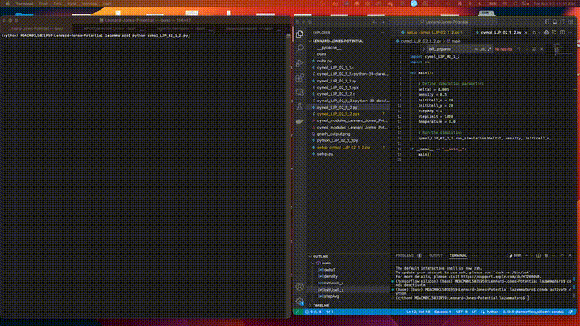

  

# Cymol
A Research and Educational Project on Classical Molecular Dynamics

Developed by Luca Zammataro, Copyright (C) 2024

## Overview

Cymol is an educational and research-oriented project designed to explore classical molecular dynamics using modern programming paradigms. Inspired by Dennis C. Rapaport's seminal textbook, "The Art of Molecular Dynamics," this project implements some examples from the book. Named "Cymol" to reflect its use of Cython, this project aims to demonstrate how Cython can produce efficient, stable, and surprisingly fast code. Join us as we step-by-step uncover the impressive capabilities of Cython in molecular dynamics simulations.
Cymol is an ongoing project, still under development, with the goal of providing a powerful tool for molecular dynamics simulations.

## Project Goals

The primary objective of Cymol is not just to reimplement existing algorithms, but to enhance them using Cython, demonstrating the power of this language in achieving highly efficient, stable, and fast computational solutions. This project serves as a practical guide to understanding the intricacies of molecular dynamics simulations and the optimization capabilities of Cython.

  

## Why Cython?

Cython offers a unique blend of simplicity and power, providing the ease of Python with the capability to achieve performance close to C languages. Through Cymol, we aim to showcase:
- **Efficiency:** How Cython can handle computationally intensive tasks.
- **Stability:** Ensuring robust simulations that are reliable and reproducible.
- **Speed:** Achieving remarkable execution times that rival traditional C-based implementations.

## Getting Started

To get involved with Cymol or try out the simulations:
1. Clone this repository.
2. Ensure you have Python and Cython installed.
3. Follow the setup instructions in our documentation to start running your own simulations.

## Examples

Compile and run two and three-dimensional simulations of the Lennard-Jones Potential (source codes available in the "modules" directory), a fundamental model used to describe interactions between particles in physics and chemistry. This simulations provide a dynamic and detailed visualization of how molecules interact through attractive and repulsive forces at varying distances.
Watch the video to explore how the Lennard-Jones Potential manifests in a 3D environment, with particles attracting and repelling each other, illustrating the dynamics that drive molecular behavior.

[Watch the video on YouTube](https://youtu.be/Y6BNPL-ZChw?si=aWSa4FRqT2bbJ3EF)

## Contribution

Contributions are welcome! Whether you're looking to fix bugs, enhance the functionality, or propose new features, please feel free to fork this repository, make changes, and submit pull requests.

## License

This project is licensed under the GNU General Public License v3.0 - see the [LICENSE](LICENSE) file for details.

## Acknowledgments

Special thanks to the foundational principles set by Dennis C. Rapaport's book, which has been instrumental in guiding this project's development.

## References

1. Rapaport DC. The Art of Molecular Dynamics Simulation. 2nd ed. Cambridge University Press; 2004.

2. Smith KW. Cython: A Guide for Python Programmers 1st Edition, O'Really ISBN-13: 978-1491901557

3. Zammataro L. The Lennard-Jones potential Why the art of molecular dynamics is so fascinating, and why I got so emotionally overwhelmed, (https://towardsdatascience.com/the-lennard-jones-potential-35b2bae9446c)

---

Join us in advancing the field of molecular dynamics through innovative programming and collaborative development!
